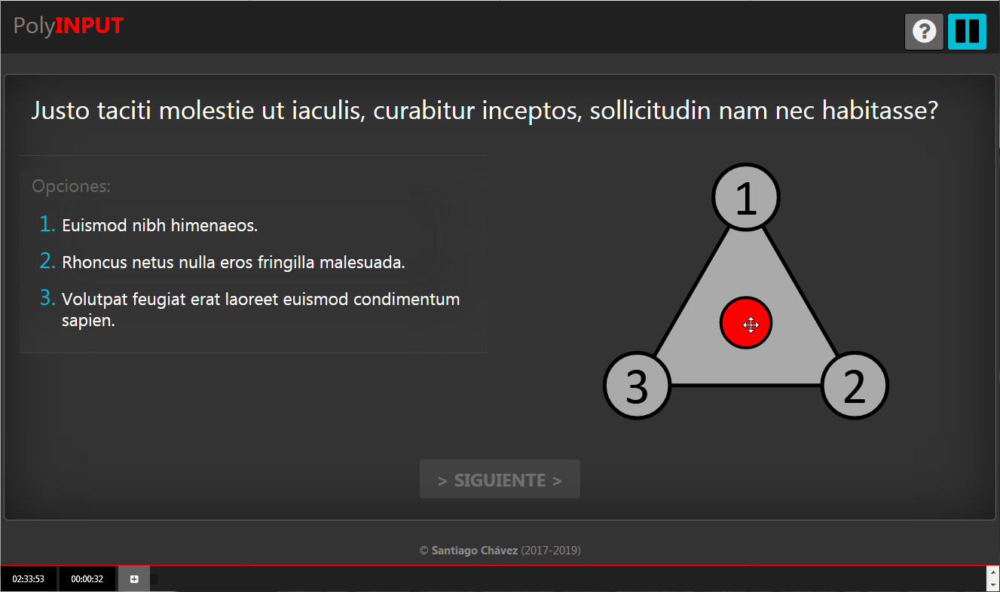
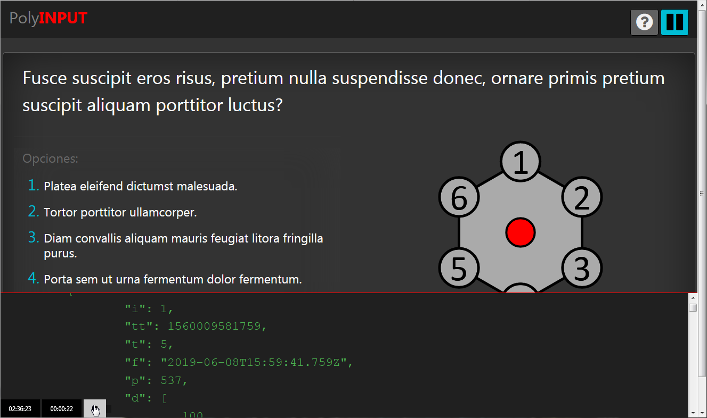

# polyInput

### PolyInput is an ES6 modern (JS Client -PHP Server) cross-browser mobile ready online/offline evaluation system.

 
### Konva.js dependent ES6 canvas polygonal input selector (click/touch/drag ready). Cross-browser (modern browsers tested).

 
### ES6/Localstorage/Fetch **2 to 9** free/snaped/middlepoints selector with built-in console debbuging.

# Dependencies

## JS dependencies:

* **[konva.min.js](konva.min.js)**
  - [Konva.js](https://konvajs.org/) is HTML5 2d Canvas JavaScript framework that enables high performance animations, node nesting, layering, filtering, caching, event handling, drag and more.
* **[idletimer.js](idletimer.js)**
  - [idletime.js](https://gist.github.com/barraponto/4547ef5718fd2d31e5cdcafef0208096) is a small ES6 class to detect activity and otherwise fire events on idle timeout. It covers keyboard, mouse and touch..

## CSS dependencies

* **[w3.css](w3.css)**
  - [W3.CSS](https://www.w3schools.com/w3css/) is a modern CSS framework with built-in responsiveness.
* **[font-awesome.min.css](font-awesome.min.css)**
  - Modified version to work with [font/](font/) folder for local testing.
  - Official font-awesome (4.7.0) resides [here](https://cdnjs.com/libraries/font-awesome/4.7.0)

# Contents

## PHP:

* **[polyInput.server.php](polyInput.server.php)**
* **[polyInput.client.php](polyInput.client.php)**

## JS:

* **[polyInput.client.js](polyInput.client.js)**
* **[polyInput.konva.js](polyInput.konva.js)**

## CSS:

* **[polyInput.client.css](polyInput.client.css)**

## USER JSON:

* **[polyInput.server.json](polyInput.server.json)**

# Extras

* **[loremIpsum.js](loremIpsum.js)** (Test only JS dependency)
  - [Lorem Ipsum generator](https://github.com/fffilo/lorem-ipsum-js) is a JavaScript random text generator.
* **[EquilateroRadio1.pdf](EquilateroRadio1.pdf)**
  - Meassurments and triangle distance calculations used for **[polyInput.konva.js](polyInput.konva.js)**.
* **[README.md](README.md)**
  - This [markdown](https://en.wikipedia.org/wiki/Markdown) file.

# Install

* **Just copy everything on some localhost forder (php 5.4+) and visit [polyInput.client.php](polyInput.client.php) with your browser.**
* It should be easy to change PHP to some other server side language as most magic happens in javascript.

# ToDo Checklist

- [x] Finish basic working implementation
- [x] 2 to 9 option selectors
- [x] Middle points between adjacent options (specially for 2 & 3 option selectors)
- [x] Free and snapped position selection
- [x] `LocalStorage` implementation and intelligent posting and updating to server via JS `Fetch`
- [x] Cross modern browser desktop testing
- [ ] Real question implementation (should come from server)
- [ ] Image in question implementation
- [ ] Specific user JSON implementation
- [ ] Cross modern browser mobile testing
- [ ] Full tests and debugging
- [ ] Full working `offline` implementation
- [ ] Make `polyInput.konva.js` a class extension of konva.js

# Author

* **Santiago Chávez** ([La Lengua](https://lengua.la))
 
# License
* Creative Commons: Attribution-NonCommercial-ShareAlike 4.0 International
  - **[LICENSE.md](LICENSE.md)**
